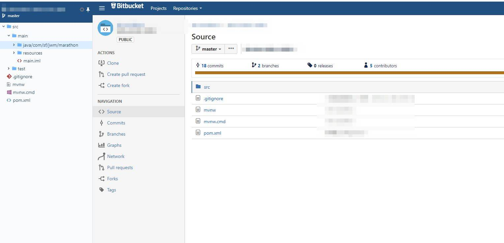

# 改造支持 Bitbucket

- Bitbucket version v5.6.2
- Bitbucket API: https://docs.atlassian.com/bitbucket-server/rest/7.1.2/bitbucket-rest.html

# 开始

1. 配置域名

> src\config\wex\manifest.json

```json
{
  // ...,
  "permissions": [
  "https://bitbucket.org/*", // 改为自己搭建的bitbucket域名
    "storage"
  ],
 "content_scripts": [
    "https://bitbucket.org/*"  // 改为自己搭建的bitbucket域名
 ]
}
```

> src\adapters\bitbucket.js

```js
// ...
const HOST = '//bitbucket.org' // 改为自己搭建的bitbucket域名
// ...
```

2. npm run build


# demo

